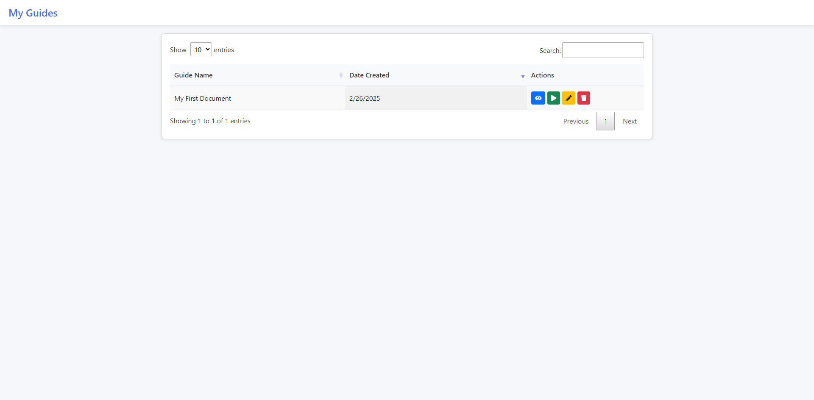
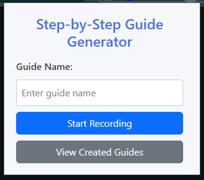

# Step-by-Step Guide Generator

A Chrome extension that allows users to easily create, edit and share interactive step-by-step guides with annotated screenshots.

## Features

- **Record user interactions** to automatically generate step-by-step guides
- **Screenshot capture** with each action
- **Rich markdown editing** with EasyMDE editor for step descriptions
  - Bold, italic, underline, lists, and links support
  - Live markdown preview
  - Undo/redo functionality (toolbar and Ctrl+Z/Ctrl+Y)
- **Step title editing** alongside description editing
- **Guide categories and tags** for better organization
- **Interactive editing** of guide content
- **Image annotation** with blur regions and sensitive information detection
- **Enhanced step reordering** with drag-and-drop functionality
- **Comprehensive export options**:
  - PDF export
  - Markdown export
  - Markdown with images as ZIP
  - Confluence format
  - Notion format
- **Resume recording** to add steps to existing guides

## Installation

### Chrome Web Store
Visit the [Chrome Web Store](https://chrome.google.com/webstore/detail/step-by-step-guide-generator/extensionid) and click "Add to Chrome".

### Manual Installation
1. Download the latest release ZIP file
2. Extract the ZIP file to a folder
3. Open Chrome and navigate to `chrome://extensions/`
4. Enable "Developer mode" in the top-right corner
5. Click "Load unpacked" and select the extracted folder

## How to Use

### Creating a Guide
1. Click the extension icon in your browser toolbar
2. Enter a name for your guide and click "Start Recording"
3. Navigate through the steps you want to record
4. Each click will be captured as a step with a screenshot
5. Click "Stop Recording" when finished

### Editing a Guide
1. Click "View Created Guides" from the extension popup
2. Select a guide to edit
3. Use the enhanced editor to:
   - Edit step titles and descriptions with rich markdown support
   - Use the EasyMDE toolbar for formatting (bold, italic, lists, links)
   - Add categories and tags to organize your guides
   - Add blur regions to screenshots with automatic sensitive info detection
   - Reorder steps by dragging them in the sidebar
   - Use undo/redo (Ctrl+Z/Ctrl+Y or toolbar buttons)
   - Delete unwanted steps

### Resuming a Guide
1. Go to "View Created Guides"
2. Click the "Resume" button next to a guide
3. Continue recording additional steps

### Exporting Guides
Guides can be exported in multiple formats:
- **PDF** - Professional document format
- **Markdown** - Plain text with formatting
- **Markdown with Images as ZIP** - Complete package with all screenshots
- **Confluence** - Ready for Atlassian Confluence
- **Notion** - Compatible with Notion workspace

## Privacy

This extension:
- Only captures screenshots during active recording
- Stores all data locally on your device
- Never sends your guides or screenshots to any server
- Requires minimum permissions to function

## Support Development

This extension is completely free! If you find it useful and would like to support continued development, please consider:

## License

MIT License - see LICENSE file for details

## Technical Details

### Architecture
- **Background Script**: Manages recording state and coordinates actions
- **Content Script**: Captures DOM interactions and sends data to background
- **Popup UI**: Controls recording and guide management
- **Guide Editor**: Interactive interface for editing and annotating guides
- **Storage Manager**: Handles local storage for guide data and images
- **Export Tools**: Converts guides to various formats

### Storage
- Guide metadata and step information: Chrome Storage Local API
- Screenshot images: IndexedDB (for larger storage capacity)

### Technologies
- JavaScript (ES6+ with ES modules)
- Chrome Extension APIs
- EasyMDE (Markdown editor)
- Marked.js (Markdown parsing)
- jQuery
- DataTables
- SweetAlert2
- IndexedDB (enhanced image storage)

## Troubleshooting

**Q: My screenshots are not being captured**
A: Make sure you've granted the extension permission to capture your screen.

**Q: The extension is using too much storage**
A: Large guides with many screenshots can consume significant storage. Export and delete guides you don't need anymore.

**Q: Can I use this extension for sensitive information?**
A: Yes, but use the blur tool to hide sensitive information before sharing guides.

## Contributing

Contributions are welcome! Please feel free to submit a Pull Request.

1. Fork the repository
2. Create your feature branch (`git checkout -b feature/amazing-feature`)
3. Commit your changes (`git commit -m 'Add some amazing feature'`)
4. Push to the branch (`git push origin feature/amazing-feature`)
5. Open a Pull Request

## Acknowledgments

- Icons from [FontAwesome](https://fontawesome.com/)
- UI components from [Bootstrap](https://getbootstrap.com/)